# 🏛️ E-Procurement Intra System

[](https://php.net)
[](https://codeigniter.com)
[](https://mysql.com)
[](LICENSE)

A comprehensive web-based **Electronic Procurement System** built with CodeIgniter 3 framework, designed for managing the entire procurement lifecycle from planning to execution. This system provides admin-only access for internal procurement management.

## 📑 Table of Contents

- [🌟 Features](#-features)
- [🏗️ System Architecture](#️-system-architecture)
- [🔄 Procurement Workflow](#-procurement-workflow)
- [🛠️ Technical Stack](#️-technical-stack)
- [📋 Prerequisites](#-prerequisites)
- [🚀 Installation](#-installation)
- [📊 Database Schema](#-database-schema-overview)
- [🔐 Security Features](#-security-features)
- [📁 Directory Structure](#-directory-structure)
- [🔧 Configuration](#-configuration)
- [🚦 Usage](#-usage)
- [📚 API Documentation](#-api-documentation)
- [🤝 Contributing](#-contributing)
- [📄 License](#-license)

## 🌟 Features

### 📋 **Planning Module (Main App)**
- **Dashboard** - Central overview of procurement activities
- **Master Data Management** - Users, currency exchange rates, vendor data
- **Perencanaan (Planning)** - Procurement planning and recapitulation
- **FPPBJ Forms** - Form Penetapan Penyedia Barang/Jasa
- **FKPBJ Forms** - Form Komite Penetapan Barang/Jasa
- **Pemaketan** - Procurement packaging and grouping
- **Timeline & Calendar** - Schedule tracking and management
- **Data Export** - Excel and PDF generation capabilities

### 🏢 **Procurement Module (Pengadaan App)**
- **Procurement Execution** - Active procurement process management
- **Vendor Management** - Vendor assessment and evaluation
- **Contract Management** - Contract lifecycle management
- **Assessment Tools** - Vendor evaluation and scoring
- **Auction Management** - Electronic auction functionality
- **Feedback System** - Vendor and procurement feedback
- **History & Audit Trail** - Complete procurement history tracking

### 🔐 **Security & Authentication**
- **Admin-Only Access** - Restricted to administrative users only
- **VMS Integration** - Integration with Vendor Management System
- **Role-Based Access Control** - Different admin role permissions
- **Session Management** - Secure session handling
- **Activity Logging** - Complete user activity tracking

## 🏗️ System Architecture

The E-Procurement Intra System consists of two main applications working together to provide a complete procurement solution:

```mermaid
graph TB
    subgraph "E-Procurement Intra System"
        subgraph "Main Application (Planning)"
            M1["🏠 Dashboard"]
            M2["👥 Master Data<br/>Management"]
            M3["📋 Perencanaan<br/>(Planning)"]
            M4["📝 FPPBJ Forms"]
            M5["📋 FKPBJ Forms"]
            M6["📦 Pemaketan<br/>(Packaging)"]
            M7["📅 Timeline &<br/>Calendar"]
            M8["📊 Data Export<br/>(Excel/PDF)"]
        end
        
        subgraph "Pengadaan Application (Procurement)"
            P1["⚙️ Procurement<br/>Execution"]
            P2["🏢 Vendor<br/>Management"]
            P3["📄 Contract<br/>Management"]
            P4["📊 Assessment<br/>Tools"]
            P5["🔨 Auction<br/>Management"]
            P6["💬 Feedback<br/>System"]
            P7["📈 History &<br/>Audit Trail"]
        end
        
        subgraph "Shared Infrastructure"
            DB1[("📁 MySQL<br/>eproc_perencanaan")]
            DB2[("📁 MySQL<br/>eproc")]
            VMS["🔗 VMS Integration"]
            AUTH["🔐 Authentication<br/>System"]
        end
    end
    
    subgraph "External Systems"
        EXT1["🌐 External<br/>Vendors"]
        EXT2["📊 Reporting<br/>Systems"]
    end
    
    %% Connections
    M1 --> M2
    M2 --> M3
    M3 --> M4
    M4 --> M5
    M5 --> M6
    M6 --> M7
    M7 --> M8
    
    P1 --> P2
    P2 --> P3
    P3 --> P4
    P4 --> P5
    P5 --> P6
    P6 --> P7
    
    M1 -.-> DB1
    M2 -.-> DB1
    M3 -.-> DB1
    M6 -.-> DB1
    
    P1 -.-> DB2
    P2 -.-> DB2
    P3 -.-> DB2
    P4 -.-> DB2
    
    AUTH --> M1
    AUTH --> P1
    VMS --> AUTH
    VMS -.-> EXT1
    
    P7 -.-> EXT2
    M8 -.-> EXT2
    
    style M1 fill:#e1f5fe
    style M2 fill:#e1f5fe
    style M3 fill:#e1f5fe
    style M4 fill:#e1f5fe
    style M5 fill:#e1f5fe
    style M6 fill:#e1f5fe
    style M7 fill:#e1f5fe
    style M8 fill:#e1f5fe
    
    style P1 fill:#f3e5f5
    style P2 fill:#f3e5f5
    style P3 fill:#f3e5f5
    style P4 fill:#f3e5f5
    style P5 fill:#f3e5f5
    style P6 fill:#f3e5f5
    style P7 fill:#f3e5f5
    
    style DB1 fill:#fff3e0
    style DB2 fill:#fff3e0
    style VMS fill:#e8f5e8
    style AUTH fill:#fff9c4
```



## 🔄 Procurement Workflow

The system follows a comprehensive procurement process from planning to execution:

```mermaid
flowchart TD
    START([🎯 Start Procurement Process]) --> PLAN["📋 Planning<br/>(Perencanaan)"]
    
    PLAN --> MASTER["👥 Master Data<br/>Setup"]
    MASTER --> FPPBJ["📝 FPPBJ Form<br/>Creation"]
    FPPBJ --> FKPBJ["📋 FKPBJ Form<br/>Approval"]
    FKPBJ --> PACKAGE["📦 Pemaketan<br/>(Packaging)"]
    
    PACKAGE --> SCHEDULE["📅 Timeline<br/>Scheduling"]
    SCHEDULE --> VENDOR["🏢 Vendor<br/>Management"]
    
    VENDOR --> ASSESS["📊 Vendor<br/>Assessment"]
    ASSESS --> AUCTION["🔨 Auction<br/>Process"]
    
    AUCTION --> EVAL{"✅ Evaluation<br/>Pass?"}
    EVAL -->|Yes| CONTRACT["📄 Contract<br/>Management"]
    EVAL -->|No| FEEDBACK["💬 Vendor<br/>Feedback"]
    
    FEEDBACK --> VENDOR
    
    CONTRACT --> EXECUTE["⚙️ Procurement<br/>Execution"]
    EXECUTE --> AUDIT["📈 Audit Trail<br/>& History"]
    
    AUDIT --> REPORT["📊 Generate<br/>Reports"]
    REPORT --> END([🏁 Process Complete])
    
    %% Admin oversight
    ADMIN["👨‍💼 Admin<br/>Oversight"] -.-> PLAN
    ADMIN -.-> VENDOR
    ADMIN -.-> CONTRACT
    ADMIN -.-> AUDIT
    
    %% External integrations
    VMS["🔗 VMS System"] -.-> VENDOR
    VMS -.-> ASSESS
    
    %% Data flow
    DB[("💾 Database<br/>Storage")] -.-> PLAN
    DB -.-> VENDOR
    DB -.-> CONTRACT
    DB -.-> AUDIT
    
    style START fill:#c8e6c9
    style PLAN fill:#e1f5fe
    style MASTER fill:#e1f5fe
    style FPPBJ fill:#e1f5fe
    style FKPBJ fill:#e1f5fe
    style PACKAGE fill:#e1f5fe
    style SCHEDULE fill:#e1f5fe
    
    style VENDOR fill:#f3e5f5
    style ASSESS fill:#f3e5f5
    style AUCTION fill:#f3e5f5
    style CONTRACT fill:#f3e5f5
    style EXECUTE fill:#f3e5f5
    style AUDIT fill:#f3e5f5
    
    style EVAL fill:#fff3e0
    style FEEDBACK fill:#fff3e0
    style REPORT fill:#fff3e0
    style END fill:#ffcdd2
    
    style ADMIN fill:#e8f5e8
    style VMS fill:#e8f5e8
    style DB fill:#fff9c4
```



## 🛠️ Technical Stack

- **Backend**: PHP 5.6 / CodeIgniter 3.x
- **Frontend**: HTML5, CSS3, JavaScript, jQuery
- **Database**: MySQL 5.7+
- **Document Generation**: DOMPDF, PHPExcel
- **UI Components**: Bootstrap, FontAwesome, DataTables
- **Charts**: HighCharts, Chart.js
- **Calendar**: FullCalendar
- **Other**: jQuery UI, DatePicker, TimePicker

### Technology Architecture

```mermaid
graph TB
    subgraph "Client Layer"
        BROWSER["🌐 Web Browser<br/>Chrome, Firefox, Edge"]
        MOBILE["📱 Mobile Browser<br/>Responsive Design"]
    end
    
    subgraph "Web Server Layer"
        IIS["🌐 IIS Web Server<br/>Windows Server"]
        PHP["🐘 PHP 5.6 Runtime<br/>FastCGI"]
    end
    
    subgraph "Application Layer"
        subgraph "Main App (Planning)"
            CI_MAIN["🔧 CodeIgniter 3.x<br/>Planning Module"]
            CTRL_MAIN["🎮 Controllers<br/>Auth, Dashboard, Forms"]
            MODEL_MAIN["📊 Models<br/>Data Processing"]
            VIEW_MAIN["👁️ Views<br/>HTML Templates"]
        end
        
        subgraph "Pengadaan App (Procurement)"
            CI_PROC["🔧 CodeIgniter 3.x<br/>Procurement Module"]
            CTRL_PROC["🎮 Controllers<br/>Vendor, Auction, Contract"]
            MODEL_PROC["📊 Models<br/>Business Logic"]
            VIEW_PROC["👁️ Views<br/>Admin Interface"]
        end
    end
    
    subgraph "Library Layer"
        DOMPDF["📄 DOMPDF<br/>PDF Generation"]
        PHPEXCEL["📊 PHPExcel<br/>Excel Export"]
        JQUERY["⚡ jQuery<br/>JavaScript Framework"]
        BOOTSTRAP["🎨 Bootstrap<br/>UI Framework"]
        DATATABLES["📋 DataTables<br/>Data Grids"]
        HIGHCHARTS["📈 HighCharts<br/>Charts & Graphs"]
        FULLCAL["📅 FullCalendar<br/>Calendar Widget"]
    end
    
    subgraph "Database Layer"
        MYSQL["🗄️ MySQL 5.7+<br/>Port 3307"]
        DB_PLAN[("📁 eproc_perencanaan<br/>Planning Database")]
        DB_PROC[("📁 eproc<br/>Procurement Database")]
    end
    
    subgraph "External Integrations"
        VMS_EXT["🔗 VMS System<br/>Vendor Management"]
        REPORT_SYS["📊 Reporting System<br/>Business Intelligence"]
    end
    
    subgraph "File System"
        UPLOADS["📁 File Uploads<br/>Documents & Attachments"]
        LOGS["📝 Application Logs<br/>Error & Activity Logs"]
        CACHE["⚡ Cache Storage<br/>Session & Data Cache"]
    end
    
    %% Client connections
    BROWSER --> IIS
    MOBILE --> IIS
    
    %% Web server connections
    IIS --> PHP
    PHP --> CI_MAIN
    PHP --> CI_PROC
    
    %% Application structure
    CI_MAIN --> CTRL_MAIN
    CI_MAIN --> MODEL_MAIN
    CI_MAIN --> VIEW_MAIN
    
    CI_PROC --> CTRL_PROC
    CI_PROC --> MODEL_PROC
    CI_PROC --> VIEW_PROC
    
    %% Library connections
    VIEW_MAIN --> JQUERY
    VIEW_MAIN --> BOOTSTRAP
    VIEW_PROC --> JQUERY
    VIEW_PROC --> BOOTSTRAP
    
    CTRL_MAIN --> DOMPDF
    CTRL_MAIN --> PHPEXCEL
    CTRL_PROC --> DOMPDF
    CTRL_PROC --> PHPEXCEL
    
    VIEW_MAIN --> DATATABLES
    VIEW_MAIN --> HIGHCHARTS
    VIEW_MAIN --> FULLCAL
    VIEW_PROC --> DATATABLES
    VIEW_PROC --> HIGHCHARTS
    
    %% Database connections
    MODEL_MAIN --> MYSQL
    MODEL_PROC --> MYSQL
    MYSQL --> DB_PLAN
    MYSQL --> DB_PROC
    
    %% External connections
    CI_MAIN -.-> VMS_EXT
    CI_PROC -.-> VMS_EXT
    CI_MAIN -.-> REPORT_SYS
    CI_PROC -.-> REPORT_SYS
    
    %% File system connections
    CI_MAIN --> UPLOADS
    CI_PROC --> UPLOADS
    CI_MAIN --> LOGS
    CI_PROC --> LOGS
    CI_MAIN --> CACHE
    CI_PROC --> CACHE
    
    style BROWSER fill:#e3f2fd
    style MOBILE fill:#e3f2fd
    style IIS fill:#fff3e0
    style PHP fill:#f3e5f5
    style CI_MAIN fill:#e1f5fe
    style CI_PROC fill:#e8f5e8
    style MYSQL fill:#fff9c4
    style VMS_EXT fill:#ffebee
    style REPORT_SYS fill:#ffebee
```



## 📋 Prerequisites

Before installation, ensure you have:

- **Web Server**: Apache, Nginx, or IIS with URL rewriting enabled
- **PHP 5.6**: Use the specific distribution at `C:\tools\php56` on Windows
- **MySQL 5.7.44+**: Database server (default setup uses Docker on `localhost:3307`)
- **Composer**: For dependency management (optional)
- **Git**: For version control

## 🚀 Installation

### 1. **Clone Repository**
```bash
git clone https://github.com/revanza-git/eproc-intra-pengadaan.git
cd eproc-intra-pengadaan
```

### 2. **Web Server Configuration**

#### Apache (.htaccess)
```apache
RewriteEngine On
RewriteCond %{REQUEST_FILENAME} !-f
RewriteCond %{REQUEST_FILENAME} !-d
RewriteRule ^(.*)$ index.php/$1 [L]
```

#### Nginx
```nginx
location / {
    try_files $uri $uri/ /index.php$is_args$args;
}
```

### 3. **Database Setup**

#### Create Databases
```sql
CREATE DATABASE eproc_perencanaan CHARACTER SET utf8 COLLATE utf8_general_ci;
CREATE DATABASE eproc_pengadaan CHARACTER SET utf8 COLLATE utf8_general_ci;
```

#### Database Schema Overview

The system uses a comprehensive relational database design to manage the complete procurement lifecycle:


#### Default Database Configuration
```php
// main/application/config/database.php
$db['default'] = array(
    'hostname' => '127.0.0.1',
    'port'     => '3307',
    'username' => 'root',
    'password' => 'Nusantara1234',
    'database' => 'eproc_perencanaan',
    'dbdriver' => 'mysqli',
    // ... other settings
);
```

### 4. **Application Configuration**

#### Set Base URLs
```php
// main/application/config/config.php
$config['base_url'] = 'http://local.eproc.intra.com/main/';
$config['pengadaan_url'] = 'http://local.eproc.intra.com/pengadaan/';
$config['vms_url'] = 'http://local.eproc.vms.com/';
```

### 5. **File Permissions**
```bash
# Linux/Mac
chmod -R 755 main/application/cache/
chmod -R 755 main/application/logs/
chmod -R 755 pengadaan/application/cache/
chmod -R 755 pengadaan/application/logs/

# Windows
# Ensure IIS_IUSRS has write permissions to cache and logs directories
```

## 🌐 Application URLs

- **Main Planning App**: `http://local.eproc.intra.com/main/`
- **Procurement App**: `http://local.eproc.intra.com/pengadaan/`
- **VMS Integration**: `http://local.eproc.vms.com/`

## 👥 Default Admin Account

For development/testing purposes:

- **Username**: `admin`
- **Password**: `admin123`
- **Role**: Super Administrator
- **Access**: Full system access

> ⚠️ **Security Note**: Change default credentials in production environment

## 📁 Directory Structure

```
eproc-intra-pengadaan/
├── main/                           # Main planning application
│   ├── application/               
│   │   ├── controllers/           # Application controllers
│   │   ├── models/               # Data models
│   │   ├── views/                # View templates
│   │   ├── config/               # Configuration files
│   │   ├── libraries/            # Custom libraries
│   │   └── helpers/              # Helper functions
│   ├── assets/                   # Frontend assets
│   │   ├── css/                  # Stylesheets
│   │   ├── js/                   # JavaScript files
│   │   ├── images/               # Image assets
│   │   └── font/                 # Font files
│   ├── system/                   # CodeIgniter framework
│   └── vendor/                   # Composer dependencies
├── pengadaan/                     # Procurement execution application
│   ├── application/
│   │   └── modules/              # HMVC modules
│   │       ├── admin/            # Admin module
│   │       ├── pengadaan/        # Procurement module
│   │       ├── vendor/           # Vendor module
│   │       └── ...               # Other modules
│   ├── assets/                   # Frontend assets
│   └── system/                   # CodeIgniter framework
├── logs/                         # Application logs
└── README.md                     # This file
```

## 🔧 Development Setup

### Enable Error Logging
```php
// Add to main/index.php
require_once(__DIR__ . '/../enable_error_logging.php');
```

### View Error Logs
Access: `http://local.eproc.intra.com/error_logger.php`

### Test Login (Development Only)
Access: `http://local.eproc.intra.com/main/test_login`

## 📊 Key Modules

### Planning (Perencanaan)
- **Form FPPBJ**: Penetapan Penyedia Barang/Jasa
- **Form FKPBJ**: Komite Penetapan Barang/Jasa
- **Pemaketan**: Package grouping and management
- **Master Data**: Currency, users, divisions

### Procurement (Pengadaan)
- **Vendor Management**: Registration, assessment, blacklist
- **Auction System**: Electronic bidding process
- **Contract Management**: Contract lifecycle
- **Evaluation**: Vendor and proposal assessment

## 🔌 API Integration

The system integrates with:
- **VMS (Vendor Management System)**: External vendor authentication
- **Key-Value Store**: Inter-application communication
- **Export Services**: Document generation services

## 📱 Browser Support

- **Chrome** 60+
- **Firefox** 55+
- **Safari** 10+
- **Edge** 40+
- **Internet Explorer** 11+

## 🧪 Testing

### Admin Test Login
```php
// Access test login interface
http://local.eproc.intra.com/main/test_login

// Direct admin login
http://local.eproc.intra.com/main/test_login/direct_admin_login
```

### Database Testing
```sql
-- Check admin user
SELECT * FROM ms_admin WHERE name = 'admin';

-- Check login credentials
SELECT * FROM ms_login WHERE username = 'admin';
```

## 🔒 Security Considerations

1. **Admin-Only Access**: System restricts access to admin users only
2. **VMS Integration**: Production authentication through VMS system
3. **Session Security**: Secure session management and validation
4. **Input Validation**: Form validation and data sanitization
5. **SQL Injection Prevention**: Parameterized queries throughout
6. **XSS Protection**: Output escaping and input filtering

## 📈 Performance

- **Caching**: Database query caching enabled
- **Asset Optimization**: Minified CSS/JS files
- **Database Indexing**: Optimized database queries
- **Session Management**: Efficient session handling

## 🛠️ Maintenance

### Log Management
- **Auto Cleanup**: Logs older than 30 days auto-deleted
- **File Rotation**: Daily log file rotation
- **Performance Tracking**: Execution time and memory monitoring

### Database Maintenance
```sql
-- Regular maintenance queries
OPTIMIZE TABLE ms_admin;
OPTIMIZE TABLE ms_login;
OPTIMIZE TABLE tr_log_activity;
```

## 🤝 Contributing

1. Fork the repository
2. Create a feature branch (`git checkout -b feature/amazing-feature`)
3. Commit changes (`git commit -m 'Add amazing feature'`)
4. Push to branch (`git push origin feature/amazing-feature`)
5. Open a Pull Request

## 📄 License

This project is licensed under the MIT License - see the [LICENSE](LICENSE) file for details.

## 📞 Support

## 📊 Understanding the Diagrams

This README includes comprehensive visual documentation to help understand the system:

### 🏗️ **System Architecture Diagram**
- **Blue boxes** (light blue): Main Application (Planning) modules
- **Purple boxes** (light purple): Pengadaan Application (Procurement) modules  
- **Orange boxes**: Database storage systems
- **Green boxes**: External integrations (VMS)
- **Yellow boxes**: Authentication and security systems

### 🔄 **Procurement Workflow Diagram**  
- **Green start/end**: Process start and completion points
- **Blue boxes**: Planning phase activities (Main App)
- **Purple boxes**: Procurement execution activities (Pengadaan App)
- **Orange decision points**: Evaluation and approval steps
- **Dotted lines**: Administrative oversight and data flow

### 📊 **Database Schema (ERD)**
- **PK**: Primary Key fields
- **FK**: Foreign Key relationships
- **Lines with symbols**: Entity relationships (one-to-many, one-to-one)
- **Table structure**: Shows all major entities and their attributes

### 🛠️ **Technology Architecture**
- **Layer-based view**: From client browsers down to database storage
- **Color coding**: Different technology layers and their connections
- **Arrows**: Data flow and communication between components

For support and questions:
- **Documentation**: Check inline code documentation
- **Issues**: Create GitHub issues for bugs
- **Development**: Follow CodeIgniter 3 best practices

---

**Note**: This system is designed for internal procurement management with admin-only access. All authentication in production should go through the proper VMS system integration. 